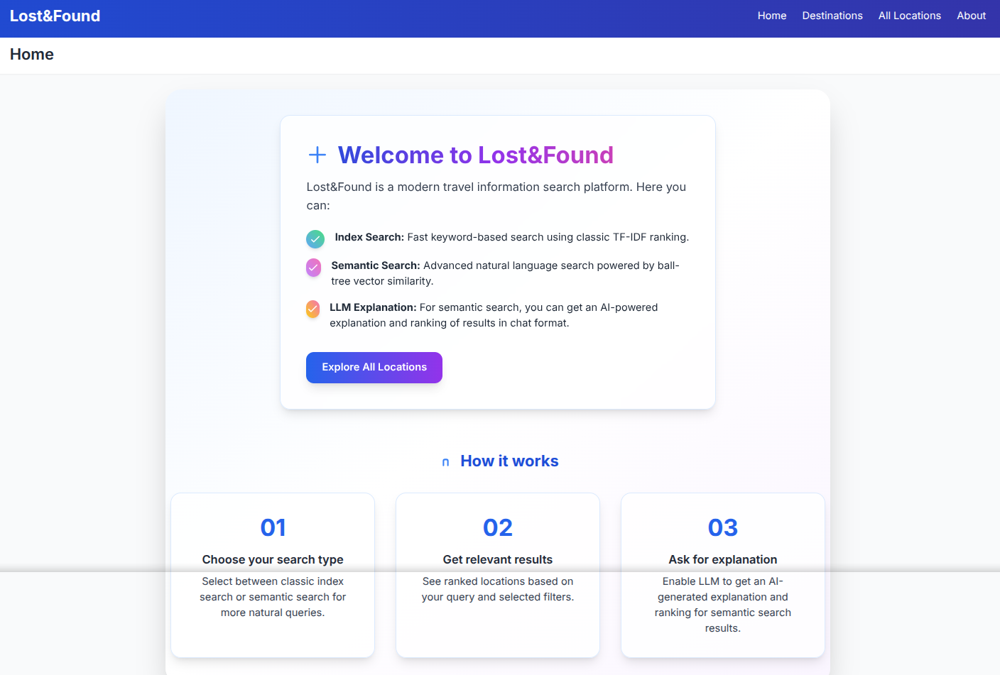
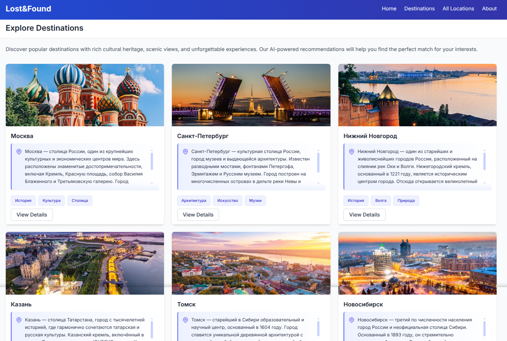
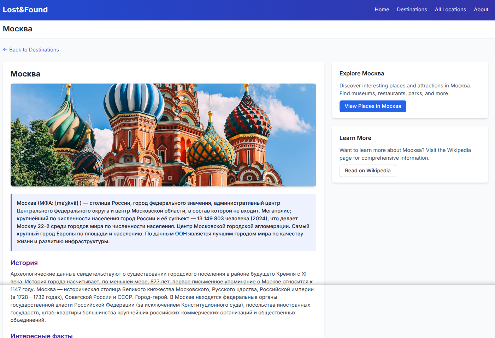
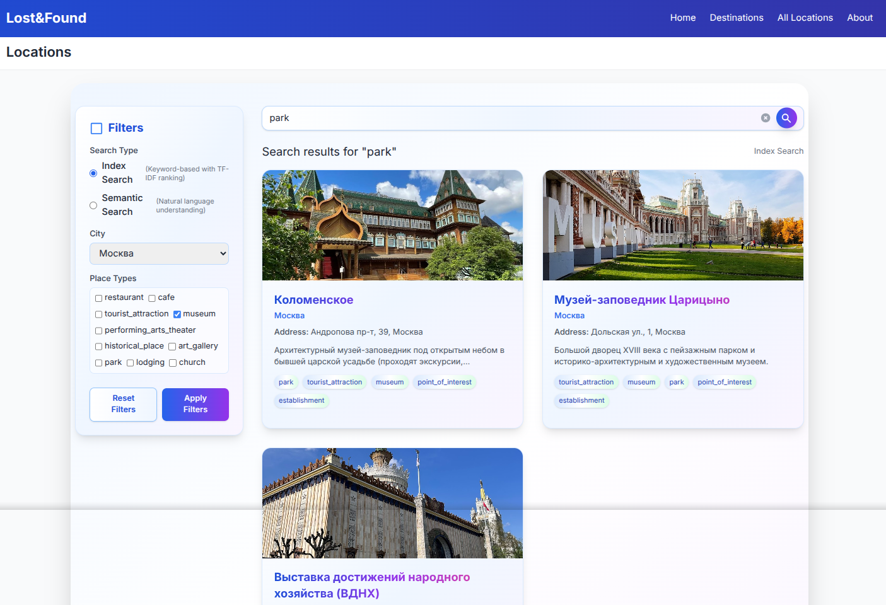
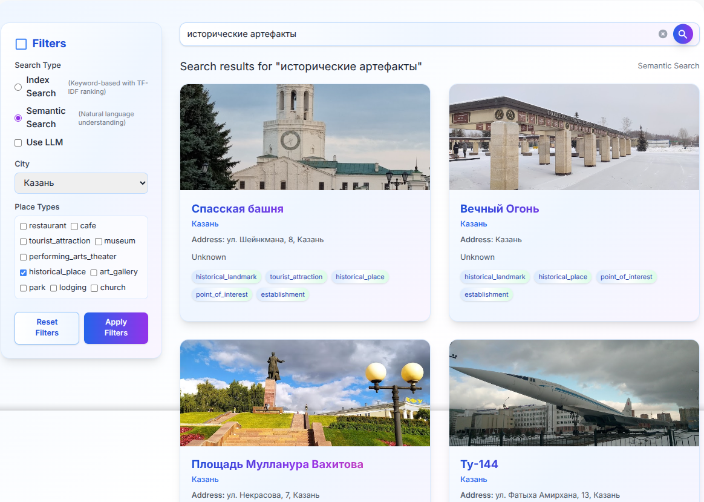
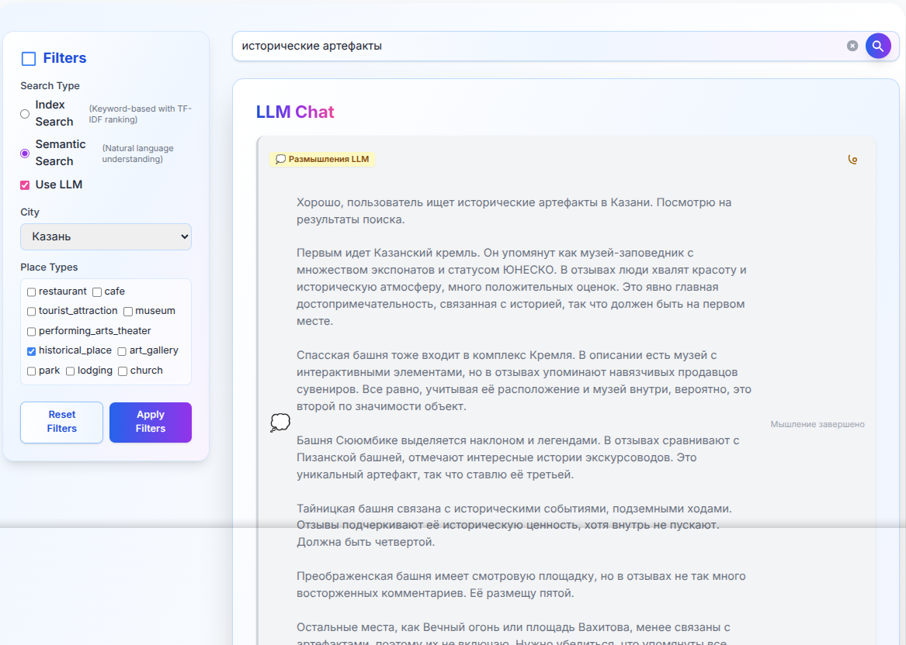
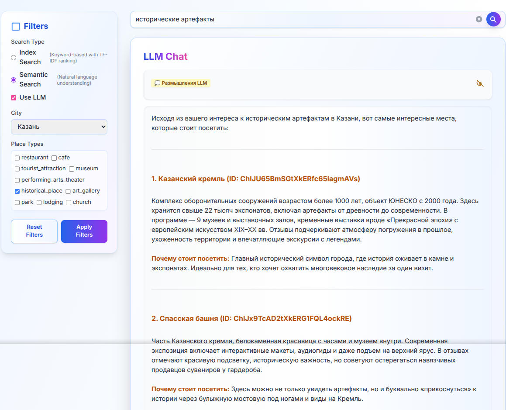
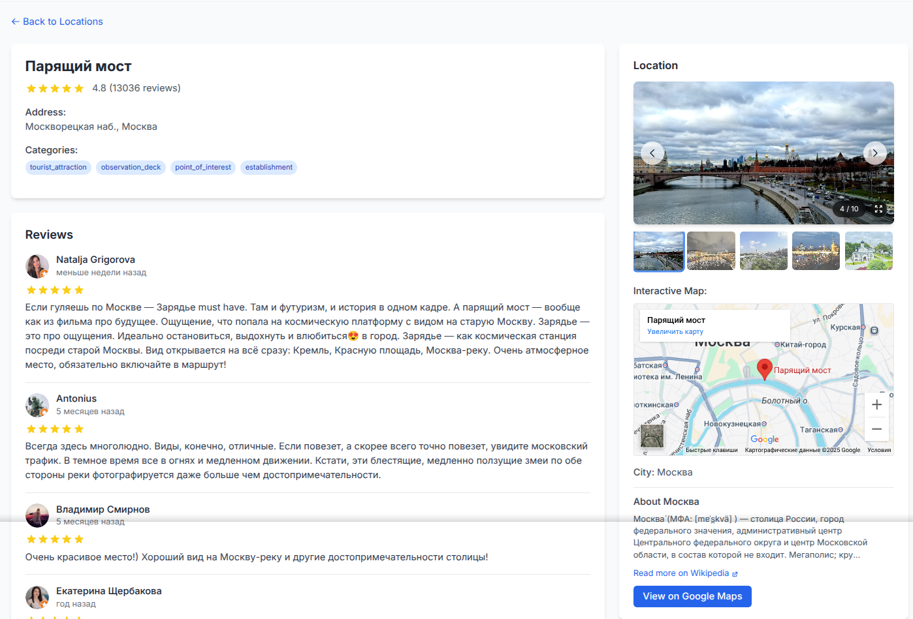

# Lost&Found

**Lost&Found** is a modern web application that leverages advanced natural language processing (NLP) and aggregated data from multiple sources to deliver personalized travel recommendations. The application combines structured data from Google Places API, comprehensive city information from Wikipedia, and additional details from web scraping to provide rich, contextual information about destinations. Each recommendation is enriched with historical insights, cultural details, and media references, ensuring users receive a comprehensive and engaging travel planning experience.

## Overview

Travelers often struggle to find destinations that truly match their unique interests. Lost&Found addresses this challenge by combining user preferences with data-driven insights to offer tailored travel suggestions. Whether you're seeking historic landmarks, scenic nature spots, or vibrant urban experiences, Lost&Found transforms travel planning into an informed and enjoyable journey.

## DEMO

<p align="center">

</p>

<p align="center">

</p>

<p align="center">

</p>

<p align="center">
  
</p>


<p align="center">

</p>

<p align="center">

</p>


## Key Features

- **Advanced Search Capabilities:**  
  - Index Search: Fast keyword-based search using classic TF-IDF ranking
  - Semantic Search: Natural language search powered by vector similarity
  - LLM-powered explanations for semantic search results
  - Optional LLM integration for enhanced result understanding
  
- **Multi-Source Data Integration:**  
  Combines data from multiple sources:
  - Google Places API for detailed place information, photos, and reviews
  - Wikipedia for comprehensive city descriptions and historical context
  - Web scraping for additional up-to-date information from relevant websites
  
- **Smart Filtering and Navigation:**  
  - Dynamic city and place type filters from system data
  - Interactive map visualization using Leaflet
  - Pagination for efficient browsing of results
  - Seamless integration between places and their cities
  
- **Rich Content Presentation:**  
  - Detailed place information with:
    - Ratings and user reviews with profile photos
    - Price levels and business hours
    - Address and location details
    - Place categories and types
  - City overviews with historical context
  - Markdown-formatted descriptions and explanations
  - Image galleries for visual exploration
  - User review system with ratings and timestamps

## Technology Stack

### Backend
- **API Framework:**  
  FastAPI for robust API creation and efficient data handling.
  
- **Data Storage:**  
  MongoDB for structured data storage and Redis for caching and message broker.
  
- **Natural Language Processing:**  
  Implements advanced LLM integration through Chutes.ai API for query understanding and response generation.
  
- **Task Queue:**  
  Celery for handling asynchronous tasks and background processing.

### Frontend
- **Framework:**  
  React 18 with React Router for client-side routing
  
- **Styling:**  
  Tailwind CSS for modern, responsive design
  
- **Maps:**  
  Leaflet with React-Leaflet for interactive maps
  
- **Build Tool:**  
  Vite for fast development and optimized production builds

## Installation and Setup

### Prerequisites
- Python 3.11 or higher
- Node.js 16 or higher
- MongoDB
- Redis
- uv package manager (recommended) or pip

### Backend Setup

1. **Install Dependencies**
   ```bash
   # Install uv (recommended package manager)
   pip install uv

   # Create and activate virtual environment
   uv venv
   source .venv/bin/activate  # Linux/Mac
   # or
   .venv\Scripts\activate  # Windows

   # Install dependencies
   uv sync
   ```

2. **Configure Environment**
   Create `.env` file in project root:
   ```env
   GOOGLE_PLACES_API=your_google_places_api_key
   CHUTES_API_KEY=your_chutes_api_key
   CHUTES_LLM_API_URL=https://llm.chutes.ai/v1/chat/completions
   ```

### Frontend Setup

1. **Install Dependencies**
   ```bash
   cd front
   npm install
   ```

### Running the Project

1. **Start Services**
   ```bash
   # Start MongoDB
   mongod

   # Start Redis
   redis-server
   ```

2. **Start Backend**
   ```bash
   # Start Celery worker
   cd ./src/core
   ./run.sh

   # In another terminal, start the FastAPI server
   cd ./src/back/api
   ./run_api.sh
   ```

3. **Start Frontend**
   ```bash
   cd front
   npm run dev
   ```

## Project Structure

```
├── front/           # Frontend React application
|   ├── src/        # React source code
│   └── static/     # Static assets
└── src/            # Backend Python application
    ├── back/       # Backend API and models
    │   ├── api/    # API endpoints
    │   ├── models/ # Data models
    │   └── routers/# API routers
    ├── configs/    # Configuration files
    ├── core/       # Core application logic
    │   ├── llm/    # LLM integration
    │   ├── indexing_search/  # Search indexing
    │   ├── semantic_search/  # Semantic search implementation
    │   └── parsers/# Data parsers
    └── utils/      # Utility functions
```

## Troubleshooting

1. **Redis Connection Issues**
   - Ensure Redis is running: `redis-cli ping` should return "PONG"
   - Check Redis port (default 6379) is not blocked by firewall

2. **MongoDB Connection Issues**
   - Verify MongoDB is running: `mongosh`
   - Check if data directory exists and has correct permissions
   - Default port is 27017

3. **Celery Worker Issues**
   - Ensure Redis is running and accessible
   - Check Celery version compatibility with Python version
   - Try running with `--pool=solo` flag if getting worker errors

4. **Frontend Development Issues**
   - Clear node_modules and reinstall if dependencies are corrupted
   - Check Vite configuration if build fails
   - Ensure API URL is correctly configured in environment variables

### Notes

- Keep your API keys secure and never commit them to version control
- Monitor the logs in `celery` and application output for potential issues
- Consider using MongoDB Compass for database visualization and management

For more detailed information about the components:
- [MongoDB Documentation](https://www.mongodb.com/docs/)
- [Redis Documentation](https://redis.io/docs)
- [Celery Documentation](https://docs.celeryq.dev/en/stable/index.html)
- [FastAPI Documentation](https://fastapi.tiangolo.com/)
- [React Documentation](https://react.dev/)
- [Vite Documentation](https://vitejs.dev/)
- [Tailwind CSS Documentation](https://tailwindcss.com/docs)


# Tunneling
> lt --port 3000

Show public ip address:
> curl https://loca.lt/mytunnelpassword